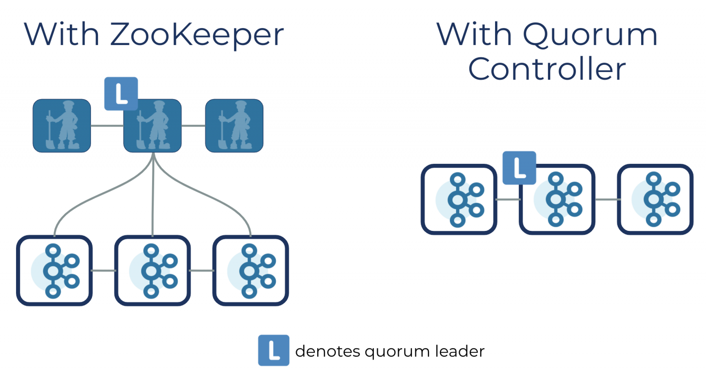

KRaft
=====
zookeeper에 대한 의존성을 제거하기 위한 `consensus protocol`

(어디서 들어봤다 했더니, k8s etcd에서 분산된 master node간 데이터 consensus 알고리즘으로 RAFT를 사용한다고 들은적이 있었다!)

zookeeper와 kafka라는 두가지 시스템을 모두 사용해야 하는 대신, 카프카 자신에 metadata에 대한 책임을 통합하면서  
카프카 아키텍처를 매우 단순화 시킬 수 있다.

#### quorum controller 장점
- 개선된 metadata management로 control plane 성능이 높아져 카프카 파티션 개수를 수백만개 까지 scale out 할 수 있어진다.
- 안정성 증가, 단순한 구조로 모니터링이 더 쉬워짐
- 전체 시스템에 대한 단일 security 모델
- 컨트롤러 장애 조치가 거의 즉각적으로 가능

#### 동작 방식

quorum controller간에 metadata가 제대로 복제됐는지 보장하기 위해 kraft protocol을 사용한다.  
quorum controller는 상태(metadata topic)를 항상 정확하게 다시 재생성할 수 있는 event-sourced storage 모델로 저장한다.  
그리고 이 메타데이터 로그가 너무 비대해지지 않도록, 주기적으로 스냅샷으로 요악함  
한 노드가 잠깐 pause했다가 rejoin하면 그 사이의 log만 append하면 되므로 금방 다시 따라잡을 수 있다.  
시스템의 worst-case 리커버리 타임을 획기적으로 줄임. (quorum controller가 시작시 zookeeper로부터 상태를 load해올 필요가 없어져서..)  

뭐 이것만 봐서는 잘 이해가 안간다..  