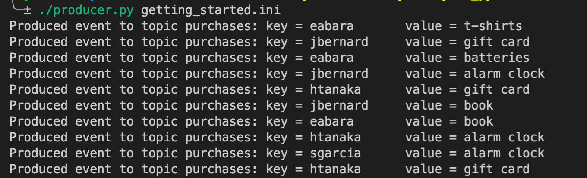
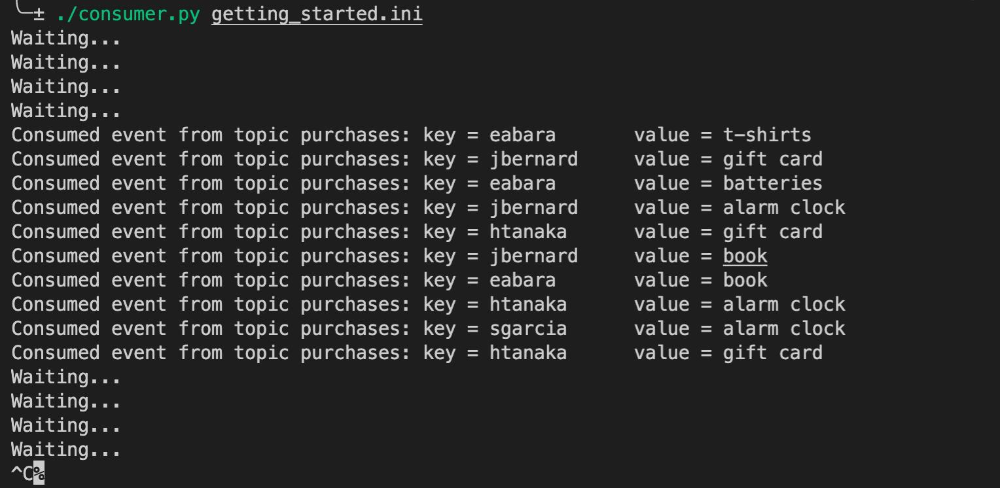

python
======
python client app 만들기 실습

예제에는 confluent cloud로 카프카 클러스터를 프로비저닝 하도록 되어있지만, 그냥 도커로 띄우자.

1) 필요한 카프카 라이브러리 설치
```
virtualenv env

source env/bin/activate

pip install confluent-kafka
```

2) 카프카 클러스터 시작하고, `purchases` 토픽 생성하기 (1_quickstart 참조..)
```
docker-compose up -d 

docker exec broker \
kafka-topics --bootstrap-server broker:9092 \
             --create \
             --topic purchases
```

3) producer app 실행
```
chmod u+x producer.py

./producer.py getting_started.ini
```


4) consumer app 실행
```
chmod u+x consumer.py

./consumer.py getting_started.ini
```
