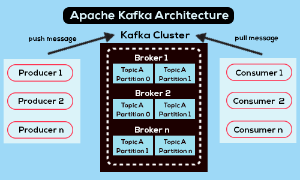
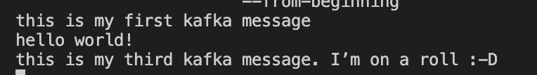

quickstart
==========



토픽 A의 파티션들이 여러개의 broker에 나뉘어 저장됨.  
broker -> 물리적  
토픽 -> 논리적  


### 1. 도커 컨테이너로 카프카 broker 띄우기
```
docker-compose up -d
```
카프카 주키퍼, 브로커 컨테이너를 도커로 띄운다

### 2. 토픽 생성하기
```
docker exec broker \
kafka-topics --bootstrap-server broker:9092 \
             --create \
             --topic quickstart
```

결과
```
Created topic quickstart.
```

브로커 컨테이너에 quickstart라는 이름의 토픽을 생성하라는 명령내림  
카프카가 이름이 참조되면 자동으로 해당 토픽 생성해주기도 하지만, 미리 명시적으로 토픽을 생성하는 것이 좋은 습관이다.  

(참고) `bootstrap-server`  
[kafka client connecting to kafka cluster - robin moffatt blog](https://www.confluent.io/blog/kafka-client-cannot-connect-to-broker-on-aws-on-docker-etc/)  
클라이언트가 카프카 클러스터랑 메세지 주고 받고 싶을 때 꼭 성공해야 하는 2가지 connection
- `bootstrap broker와의 initial connection` : 클러스터에 있는 모든 broker의 리스트와 커넥션 엔드포인트에 대한 메타데이터를 클라이언트에 전달해줌
- 1번 과정에서 전달 받은 브로커 중 1개 (or more)에 연결

### 3. 토픽에 메세지 쓰기
`kafka-console-producer` cli tool을 사용해서 토픽에 메세지 produce.  
테스트 용으로 사용하고, 실전에서는 producer api를 사용할 것

```
docker exec --interactive --tty broker \
kafka-console-producer --bootstrap-server broker:9092 \
                       --topic quickstart
```
broker 컨테이너 interactive terminal에다가 다음과 같이 cli 명령을 내리고
다음 메세지를 쳐보자. 다 쳤으면 ctrl+d
```
this is my first kafka message
hello world!
this is my third kafka message. I’m on a roll :-D
```

### 4. 토픽에서 메세지 읽기
```
docker exec --interactive --tty broker \
kafka-console-consumer --bootstrap-server broker:9092 \
                       --topic quickstart \
                       --from-beginning
```
`--from-beginning` 옵션은 토픽 제일 처음부터 읽겠다는 뜻~  
조금 기다리면 아까 토픽에 넣었던 이 메세지들이 뜬다


### 5. 컨테이너 종료
```
docker-compose down
```