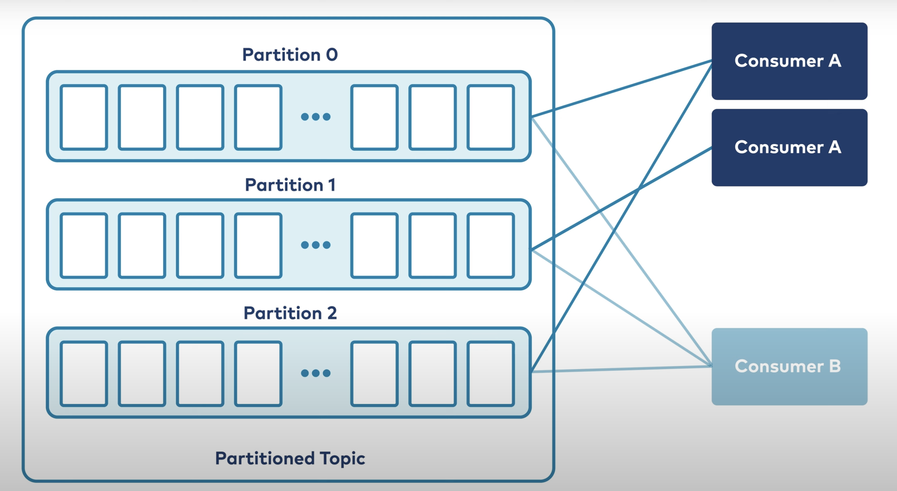

Consumers
=========

### consumer api

producr api 사용법과 비슷하다

```java
try (final KafkaConsumer<String, Payment> consumer = new KafkaConsumer<>(props))
     {consumer.subscribe(Collections.singletonList(TOPIC));

     while (true) {
        ConsumerRecords<String, Payment> records = consumer.poll(100);
        for (ConsumerRecord<String, Payment> record : records) {
            String key = record.key();
            Payment value = record.value();
            System.out.printf("key = %s, value = %s%n", key, value);
        }
      }
    }
```

`KafkaConsume` -> 클러스터에 연결하기. (파라미터로 config 정보 전달). 1개 이상의 TOPIC을 subscribe하는데 사용.  
`ConsumerRecords` -> 토픽에서 읽어들인 메세지 collection  
`ConsumerRecord` -> key/value 형태의 individual 메세지 객체. 


### consumer group
#### legacy message 큐와 카프카의 다른점  
=> reading message does not destroy it! 다른 consumer도 같은 메세지를 읽을 수 있다 (큐가 아니라 log이기 때문에)  
=> 고로 한 topic을 여러 consumer가 subscribe 하는 것이 카프카에서는 일반적인 일이다.  

#### 시나리오  
computation cost 관점에서, 한가지 consumer 인스턴스가 topic의 모든 메세지를 처리하기 힘들 때.. 
consumer도 scaling이 필요하다 

`한 파티션안의 메세지` -> order 보장  
`파티션 간 order` -> not guaranteed  



consumer 인스턴스가 추가되면 자동으로 `rebalancing process`를 트리거해서
해당 topic의 파티션을 각 consumer 인스턴스로 분배해준다.  
(distribute partitions fairly between consumer instances)   
consumer 그룹 인스턴스를 추가, 삭제 할때마다 이 rebalancing 작업 다시함.

1 <= consumer 인스턴스 수 <= partition 수  
(그 이상의 consumer 인스턴스는 추가해봤자 idle)

**이 작업을 위해 개발자가 따로 뭔가를 해줄 필요가 전혀 없다 default로 제공하는 기능! group_id 명시

전통적인 메세지 큐에서도 consumer scale out이 가능하지만, 메세지간 order를 놓치기 쉬움...
