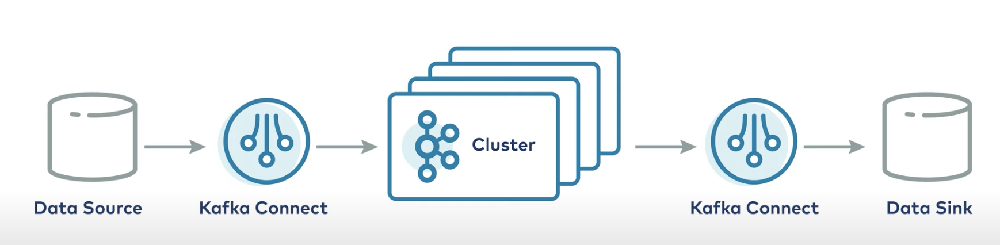

Kafka Connect
=============



pluggable data integration system 이자 client application (cluster 외부에 client process로 존재)

다른 시스템에 있는 데이터 <-(가져오기, 가져가기)-> 카프카 클러스터 내부   
를 위해 사용됨

HA, fault tolerant => 여러 connect worker 인스턴스의 클러스터로 운영할 수 있음.

개발자가 connector를 실행하기 위해 그저 `json config`만 작성해주면 된다.

예) kafka -> elastic-search
```json
{
    "connector.class": "io.confluent.connect.elasticsearch.ElasticsearchSinkConnector",
    "topics"         : "my_topic",
    "connection.url" : "http://elasticsearch:9200",
    "type.name"      : "_doc",
    "key.ignore"     : "true",
    "schema.ignore"  : "true"
}
```

connector : jar file deploy -> runtime 환경으로 instantiate  
`source connector` : 카프카 입장에서 Producer  
`sink connector` : 카프카 입장에서 Consumer  

confluent hub에서 각종 connector를 다운받을 수 있다. 오픈소스도 있고, 돈내고 써야하는 것도 있음


Schema Registry
===============

새로운 application, team이 기존의 topic을 새롭게 subscirbe하게 되는 상황이라면, 메세지 format을 아는 것이 매우 중요하다.  
게다가 business 변화에 따라 format도 evolve 함!  
(예를 들자면 주문 메세지에 새로운 상태값 추가, 등등...)

- standalone server process. external to kafka broker
- 모든 스키마의 데이터베이스 (원본은 카프카 토픽에 저장되어 있지만, low latency를 위해 스키마 Registry에 캐싱..?)
  
- 또한 prodcuer/consumer api의 일부분이기도 하다 (호환 가능한 버전인지 질의 가능)
- 예를들어 producer가 produce하는 시점에, schema registry 엔드포인트에 REST api call로 compatible한 메세지만 success.
- consumer가 imcompatible version 메세지를 read하려고 하면, schema registry가 그 메세지 consume하지 말라고 함
- 이런 runtime failure로 문제를 파악할 수 있게 해서 트러블슈팅이 더 쉬워짐

#### 지원하는 serialization format
`JSON`, `Avro`, `Protocol Buffer`

runtime failure를 좀 제거할 수 있다는 발전 외에도, 스키마 변경사항을 파일로 관리하고 pr 받고 할 수 있게 됨. (예를 들어 avro라면 .avsc file)